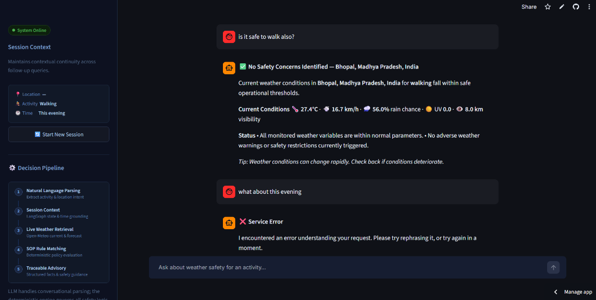

# 🌦️ Policy-Governed Weather Advisory Bot

A production-grade, conversational weather-safety advisory assistant powered by **LangGraph**, **Google Gemini**, and the **Open-Meteo API**.

Traditional AI assistants often hallucinate safety advice or provide subjective judgments when asked questions like *"Is it safe to cycle today?"* or *"Can I take my toddler to the park in Bhopal?"*. 

This system solves that by enforcing strict architectural separation:
1. **LLM for Language Understanding**: Interprets user intent, location, time context, and activity categories.
2. **Open-Meteo for Ground Truth**: Fetches live atmospheric observations and forecasts.
3. **Deterministic SOP Engine for Decisions**: Evaluates explicit, declarative safety rules (Standard Operating Procedures).
4. **Traceable Explanations**: Generates clear, audit-ready advisories linking decisions directly to verified policies.

---

## 🖼️ User Interface & Application Screenshots

| Conversational Advisory & Weather Metrics | Sidebar Active State & System Pipeline |
| :---: | :---: |
|  |  |

---


## 🏛️ Architecture

```
                       User Question
                             │
                             ▼
┌───────────────────────────────────────────────────────────┐
│                    LangGraph Workflow                     │
│                                                           │
│  parse_intent ──► resolve_location ──► fetch_weather      │
│      │                   │                   │            │
│   (Gemini             (Geocoding         (Open-Meteo      │
│    JSON mode)           Service)          Forecast)       │
│      │                   │                   │            │
│      │            ── failure ──►      ── failure ──►      │
│      │            error_response      error_response      │
│      ▼                                       │            │
│  extract_facts ◄─────────────────────────────┘            │
│      │                                                    │
│      ▼                                                    │
│  match_sops (Deterministic Rule Evaluation)               │
│      │                                                    │
│      ├── no match ──► no_match_response                   │
│      ▼                                                    │
│  resolve_policy (Override > Severity > Priority)          │
│      │                                                    │
│      ▼                                                    │
│  generate_response (Natural Grounded Advisory)            │
│      │                                                    │
│      ▼                                                    │
│    Final User Advisory                                    │
└───────────────────────────────────────────────────────────┘
```

---

## ✨ Key Features

- **Zero Safety Hallucination**: The LLM is never allowed to determine safety thresholds or invent weather numbers.
- **Declarative SOP Engine (`policies/sops.yaml`)**: Policies define leaf conditions, logical combinations (`all`, `any`, `not`), and weighted scoring without code changes.
- **Deterministic Conflict Resolution**: When multiple policies trigger, overrides take precedence, followed by severity (`critical` > `high` > `moderate` > `low`) and numerical priority.
- **Conversational Memory**: Powered by LangGraph's checkpointer to maintain location, activity, and time context across follow-up queries.
- **Adaptive Fallback**: If the LLM service hits quota limits, the system seamlessly falls back to template-based rendering and heuristic intent parsing.
- **Streamlit UI**: Dark mode UI with pipeline visualizer, active session state card, and activity shortcuts.

## 📖 How to Use WeatherGuard (Multi-Turn Step-by-Step Flow)

WeatherGuard maintains conversational memory across consecutive prompts:

| Step | Prompt Purpose | Example Prompts | What Happens |
|---|---|---|---|
| **Prompt 1** | **Initial Query** | • `"Is it safe to ride in Mumbai?"`<br>• `"Weather guidance of Zirakpur"`<br>• `"Zirakpur"` *(direct city)* | Extracted activity, city coordinates, live weather & SOP evaluation |
| **Prompt 2** | **Time Follow-up** | • `"What about this evening?"`<br>• `"How about tomorrow morning?"`<br>• `"Tonight"` | Updates forecast target time without losing city or activity |
| **Prompt 3** | **Location Switch** | • `"What about in Delhi?"`<br>• `"Chandigarh"`<br>• `"London, UK"` | Switches coordinates and fetches live weather for the new city |
| **Prompt 4** | **Activity Switch** | • `"What about walking?"`<br>• `"Is it safe for children?"`<br>• `"Can I go swimming?"` | Re-evaluates safety policies for the new activity at the same location |

---

## 📁 Repository Structure

```
weather-advisory-support-bot/
├── app/
│   ├── graph/               # LangGraph state machine & nodes
│   │   ├── nodes/           # Individual graph step implementations
│   │   ├── graph.py         # StateGraph builder and compiler
│   │   └── state.py         # Typed state schema (BotState)
│   ├── llm/                 # Gemini API client & intent parsing
│   │   ├── client.py        # google-genai client configuration
│   │   ├── intent_parser.py # Structured JSON intent extraction
│   │   └── normalizer.py    # Query normalization & typo tolerance
│   ├── policy/              # Deterministic safety rule engine
│   │   ├── evaluator.py     # AST condition evaluation & scoring
│   │   ├── loader.py        # YAML policy parser & validator
│   │   ├── matcher.py       # SOP matching against weather facts
│   │   ├── models.py        # Pydantic condition & decision schemas
│   │   └── selector.py      # Deterministic conflict resolution
│   └── weather/             # Live weather retrieval
│       ├── field_requirements.py # Dynamic API parameter mapping
│       ├── geocoding.py     # Open-Meteo geocoding client
│       ├── models.py        # Typed WeatherFacts container
│       └── open_meteo.py    # Forecast API client
├── policies/
│   ├── sops.yaml            # Declarative safety policies (SOPs)
│   └── messages.yaml        # Clarification message templates (no Python changes needed)
├── .streamlit/
│   └── config.toml          # Streamlit theme & server configuration
├── streamlit_app.py         # Main Streamlit web application
├── requirements.txt         # Production dependencies
├── .env.example             # Template for API keys
└── README.md                # Project documentation
```

---

## 🚀 Quickstart (Run Locally)

### 1. Clone the repository
```bash
git clone https://github.com/VanshAngaria/WeatherGuard.git
cd WeatherGuard
```

### 2. Create and activate a virtual environment
```bash
python -m venv .venv

# On Linux/macOS:
source .venv/bin/activate

# On Windows:
.venv\Scripts\activate
```

### 3. Install dependencies
```bash
pip install -r requirements.txt
```

### 4. Configure your Gemini API Key
Create a `.env` file from the template:
```bash
cp .env.example .env
```
Add your free Google Gemini API key:
```env
GEMINI_API_KEY=your_gemini_api_key_here
```

### 5. Launch the Streamlit application
```bash
streamlit run streamlit_app.py
```
The app will open automatically in your browser at `http://localhost:8501`.

---

## ☁️ Deploying to Streamlit Community Cloud

This project is configured for **1-click deployment** to [Streamlit Community Cloud](https://streamlit.io/cloud):

1. Push your repository to **GitHub**.
2. Log in to [share.streamlit.io](https://share.streamlit.io).
3. Click **"New app"** and select your repository:
   - **Repository**: `your-username/weather-advisory-support-bot`
   - **Branch**: `master` (or `main`)
   - **Main file path**: `streamlit_app.py`
4. Click **"Advanced settings"** and configure your Secrets:
   ```toml
   GEMINI_API_KEY = "your_gemini_api_key_here"
   ```
5. Click **"Deploy!"**.

*(Note: Users without secrets configured can also input their API key directly via the sidebar in the live web app).*

---

## 💡 Supported Activities

The advisory system evaluates safety policies across key activity domains:
- 🚴 **Cycling** (commute, road cycling, recreational)
- 🚶 **Walking & Pedestrian Travel**
- 🏃 **Running & Outdoor Workouts**
- 🚗 **Commuting & Two-Wheelers** (scooters, motorbikes)
- 🧺 **Picnics & Outdoor Recreation**
- 👨‍👩‍👧 **Children Outdoors** (heat stress, playground conditions)
- 👴 **Elderly Outdoor Activities** (heat, cold, humidity thresholds)

---

## 📜 Standard Operating Procedure (SOP) Library

Safety policies are defined declaratively in `policies/sops.yaml`. Adding a new policy requires **zero changes** to the underlying graph workflow or weather client — only a new YAML entry:

```yaml
# Example: SOP-005 — overrides everything when a thunderstorm is detected
- id: SOP-005
  title: "Thunderstorm During Any Outdoor Activity"
  category: outdoor_recreation
  severity: critical
  match_type: rule
  overrides: true          # overrides all lower-severity SOPs
  priority: 1
  applies_to_categories: ["*"]   # applies to every activity category
  required_fields:
    - weathercode
  condition:
    type: leaf
    field: weathercode
    op: in
    value: [95, 96, 99]    # WMO thunderstorm codes
  advice_template: >
    🚨 Thunderstorm active (code {weathercode}). Seek shelter immediately.
    Do not continue any outdoor activity until 30 minutes after the last thunder.
```

To add an 11th SOP during a live review call: add a new entry here, restart the app. No Python files change.
